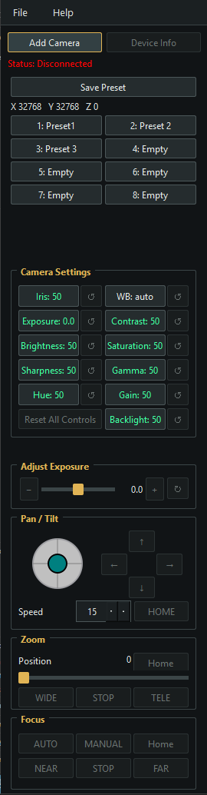

<p align="center">
  
</p>

<h1 align="center">MerekaiPTZControl</h1>

<p align="center"><strong>Command the frame. Own the shot.</strong></p>

<p align="center">
  <a href="#english">English</a> · <a href="#espanol">Español</a>
</p>

## English

### One control room for your PTZ cameras

MerekaiPTZControl brings essential camera moves and image adjustments into one focused desktop interface. Frame a shot, fine-tune the image, and save useful camera positions without juggling separate control tools.

Designed for studios, live streams, classrooms, and meeting spaces, the app offers:

- **Direct camera movement** — pan, tilt, and zoom, with configurable movement speeds.
- **Image adjustments** — focus, exposure, white balance, and other controls when the camera exposes them.
- **Repeatable shots** — save and recall camera presets.
- **Flexible connections** — use serial VISCA, Linux V4L2, or the optional Windows DirectShow/UVC bridge.
- **A portable Windows build** — package the desktop app as a single-file x64 executable.

### Camera compatibility

Compatibility depends on the camera, its firmware, operating system, and available control interface:

- **Serial VISCA:** cameras that accept the supported VISCA commands over a serial connection.
- **Linux V4L2:** cameras exposing standard V4L2 pan/tilt controls. Install `v4l-utils` to enable `v4l2-ctl` discovery.
- **Windows UVC/DirectShow:** cameras exposing the relevant standard UVC controls through DirectShow. The optional native bridge is required.

Discovery and individual controls vary by camera. See [Linux and UVC support details](V4L2_SUPPORT.md) and the [Windows bridge guide](native/README.md).

### Cameras Tested

- USB PTZ cameras
- Rally cameras
- OBSBOT Tiny

### User manual

<p align="center">
  
</p>

The screenshot shows the control window while disconnected. Connect a camera before using its controls; available actions depend on the camera's supported interface and capabilities.

#### Connect and select a camera

1. Select **Add Camera** to open the list of detected cameras, then choose one. The app adds it to the camera buttons and attempts to connect.
2. Check the status shown below the connection buttons. Select another camera button to activate it. Use **Device Info** to inspect the active camera.
3. Right-click a camera button to disconnect it or remove it from the list.

#### Save and recall presets

- The **X**, **Y**, and **Z** readout represents pan, tilt, and zoom position. Position values may be estimated when the camera cannot report them.
- Select **Save Preset**, then select one of the eight preset slots to save the current position and supported control settings.
- Select a saved slot to recall it. Depending on the camera, the app uses its hardware preset feature or restores a software-saved position and settings.
- Right-click a slot to rename it.

#### Adjust camera settings

- Select a tile in **Camera Settings** to show its adjustment controls below. In the screenshot, **Exposure** is selected.
- Use the slider or **−**/**+** buttons to change the selected value. Select its reset button to restore the default. **Reset All Controls** restores defaults for supported controls.
- Right-click a settings tile to rename it or hide/show that tile.

#### Move, zoom, and focus

- **Pan / Tilt:** drag the joystick or press and hold an arrow button. Release to stop. Adjust **Speed** as needed; **HOME** returns pan and tilt to center.
- **Zoom:** drag the position slider for absolute zoom when supported. Press and hold **WIDE** or **TELE** for continuous movement; release or select **STOP** to stop. **Home** returns zoom to its wide/default position.
- **Focus:** select **AUTO** or **MANUAL**. In manual mode, press and hold **NEAR** or **FAR** to adjust focus; release or select **STOP** to stop. **Home** restores autofocus.

Controls are enabled only when a camera is connected and reports the required capability. A camera may support some controls but not others.

To change the interface language, open **Settings** and choose **English** or **Español** under **Language**. The selection is saved with the application settings and takes effect immediately.

### Get started

Requires Python 3.8 or newer and a compatible camera. From the project folder:

```powershell
py -m venv dev\.venv
.\dev\.venv\Scripts\python.exe -m pip install -e .
.\dev\.venv\Scripts\python.exe main.py
```

On Linux or macOS:

```sh
python3 -m venv dev/.venv
source dev/.venv/bin/activate
python -m pip install -e .
python main.py
```

### Build the portable Windows app

Build on Windows with 64-bit Python. Prepare the build environment, then create the x64 executable:

```powershell
py -3 -m venv dev\.venv
.\dev\.venv\Scripts\python.exe -m pip install -e ".[build]"
.\scripts\build_windows.ps1
```

The executable is written to `dev\artifacts\windows-x64`. To include Windows UVC support, first build the optional native bridge with Visual Studio 2022, the C++ MFC component, and CMake; follow the [bridge build instructions](native/README.md). When the bridge is included, the build also generates `native-bridge-source.zip` with its source and GPL-3.0-or-later license.

### Develop and test

```powershell
python -m pip install -e ".[dev]"
python -m pytest
```

Settings, presets, and logs stay in the local `dev/` directory for source runs and `%LOCALAPPDATA%\MerekaiPTZControl` for the portable Windows app. Review files for private camera or network details before publishing or sharing them.

### Inherited projects and acknowledgements

- **PTZControl** — by Martin Richter (`xMRi-Software`): [upstream GitHub project](https://github.com/xMRi/PTZControl). Thank you to Martin Richter and the project contributors for making their work available. MerekaiPTZControl is not a fork of the complete upstream project; its optional Windows bridge incorporates the required camera Extension Unit source files from PTZControl. Those files retain their upstream notices and are licensed under GNU GPL v3 or later (`GPL-3.0-or-later`). See the upstream [license](https://github.com/xMRi/PTZControl/blob/ac1ed46cb92293b6881e285a2eed9330300df53d/LICENSE), the [included license](native/ptzcontrol/COPYING), and the [bridge notes](native/README.md).

### Experimental status and disclaimer

MerekaiPTZControl is experimental work provided for evaluation and development. It may contain defects, incomplete camera support, or behavior that varies by camera, firmware, operating system, driver, or connection method. Use it at your own risk, supervise connected equipment, and verify camera movement and other controls before using it in a live, production, safety-critical, or otherwise consequential environment. The authors and contributors are not responsible for damage to cameras, lenses, computers, networks, property, data, or other losses resulting from use of the software. No availability, compatibility, accuracy, or fitness for a particular purpose is promised. Third-party components remain subject to their own licenses and disclaimers.

### License

The original Python application, tests, and documentation are licensed under MIT; see [LICENSE](LICENSE). The optional Windows bridge incorporates GPL-3.0-or-later PTZControl source; see its [license and notices](native/README.md). PyQt6 is offered under GPL v3 or a commercial license. The MIT license for this project does not replace third-party license terms. Before distributing a built application, review the applicable PyQt6/Qt and dependency license obligations.

## Español

### Un centro de control para tus cámaras PTZ

MerekaiPTZControl reúne los movimientos esenciales de cámara y los ajustes de imagen en una aplicación de escritorio sencilla y especializada. Encuadra, afina la imagen y guarda posiciones útiles sin depender de varias herramientas de control.

Diseñada para estudios, retransmisiones en directo, aulas y salas de reuniones, la aplicación ofrece:

- **Movimiento directo de cámara** — paneo, inclinación y zoom con velocidades configurables.
- **Ajustes de imagen** — enfoque, exposición, balance de blancos y otros controles, si la cámara los ofrece.
- **Encuadres repetibles** — guarda y recupera preajustes de cámara.
- **Conexiones flexibles** — VISCA serie, V4L2 en Linux o el puente opcional DirectShow/UVC para Windows.
- **Versión portátil para Windows** — empaqueta la aplicación como un único ejecutable x64.

### Compatibilidad con cámaras

La compatibilidad depende de la cámara, su firmware, el sistema operativo y la interfaz de control disponible:

- **VISCA serie:** cámaras que aceptan los comandos VISCA compatibles mediante una conexión serie.
- **V4L2 en Linux:** cámaras que exponen controles estándar V4L2 de paneo e inclinación. Instala `v4l-utils` para habilitar la detección con `v4l2-ctl`.
- **UVC/DirectShow en Windows:** cámaras que exponen los controles UVC estándar correspondientes a través de DirectShow. Se requiere el puente nativo opcional.

La detección y los controles disponibles varían según la cámara. Consulta los [detalles de compatibilidad con Linux y UVC](V4L2_SUPPORT.md) y la [guía del puente para Windows](native/README.md).

### Cámaras probadas

- Cámaras PTZ USB
- Cámaras Rally
- OBSBOT Tiny

### Manual de usuario

La [captura de la ventana](screenshot.png) muestra la aplicación desconectada. Conecta una cámara antes de utilizar sus controles; las acciones disponibles dependen de la interfaz y las capacidades que admita la cámara.

#### Conectar y seleccionar una cámara

1. Selecciona **Añadir cámara** para abrir la lista de cámaras detectadas y elige una. La aplicación la añade a los botones de cámara e intenta conectarse.
2. Comprueba el estado debajo de los botones de conexión. Selecciona otro botón para activar otra cámara. Usa **Información del dispositivo** para consultar la cámara activa.
3. Haz clic derecho en un botón de cámara para desconectarla o quitarla de la lista.

#### Guardar y recuperar preajustes

- El indicador **X**, **Y** y **Z** representa las posiciones de paneo, inclinación y zoom. La posición puede ser estimada si la cámara no puede comunicarla.
- Selecciona **Guardar preajuste** y luego uno de los ocho espacios para guardar la posición actual y los ajustes compatibles.
- Selecciona un espacio guardado para recuperar el preajuste. Según la cámara, la aplicación utiliza los preajustes del dispositivo o restaura una posición y unos ajustes guardados por software.
- Haz clic derecho en un espacio para cambiarle el nombre.

#### Ajustar la configuración de cámara

- Selecciona un recuadro en **Configuración de cámara** para mostrar debajo los controles correspondientes. En la captura está seleccionada **Exposición**.
- Usa el deslizador o los botones **−**/**+** para cambiar el valor. Selecciona el botón de restablecer para recuperar el valor predeterminado. **Restablecer** restaura los valores predeterminados de los controles compatibles.
- Haz clic derecho en un recuadro para cambiarle el nombre u ocultarlo/mostrarlo.

#### Movimiento, zoom y enfoque

- **Paneo / inclinación:** arrastra el joystick o mantén pulsada una flecha. Suéltala para detener el movimiento. Ajusta **Velocidad** según necesites; **INICIO** centra el paneo y la inclinación.
- **Zoom:** arrastra el deslizador de posición para ajustar el zoom absoluto cuando esté disponible. Mantén **ANCHO** o **TELE** para moverlo continuamente; suelta el botón o pulsa **PARAR** para detenerlo. **Inicio** devuelve el zoom a la posición inicial gran angular.
- **Enfoque:** selecciona **AUTO** o **MANUAL**. En modo manual, mantén **CERCA** o **LEJOS** para ajustar el enfoque; suelta el botón o pulsa **PARAR** para detenerlo. **Inicio** vuelve al enfoque automático.

Los controles solo se habilitan cuando hay una cámara conectada que declara la capacidad correspondiente. Una cámara puede admitir algunos controles, pero no otros.

Para cambiar el idioma de la interfaz, abre **Configuración** y elige **English** o **Español** en **Idioma**. La selección se guarda con la configuración de la aplicación y se aplica inmediatamente.

### Primeros pasos

Se requiere Python 3.8 o posterior y una cámara compatible. Desde la carpeta del proyecto:

```powershell
py -m venv dev\.venv
.\dev\.venv\Scripts\python.exe -m pip install -e .
.\dev\.venv\Scripts\python.exe main.py
```

En Linux o macOS:

```sh
python3 -m venv dev/.venv
source dev/.venv/bin/activate
python -m pip install -e .
python main.py
```

### Crear la aplicación portátil para Windows

Compila en Windows con Python de 64 bits. Prepara el entorno y genera el ejecutable x64:

```powershell
py -3 -m venv dev\.venv
.\dev\.venv\Scripts\python.exe -m pip install -e ".[build]"
.\scripts\build_windows.ps1
```

El ejecutable se guarda en `dev\artifacts\windows-x64`. Para incluir compatibilidad UVC en Windows, compila primero el puente nativo opcional con Visual Studio 2022, el componente C++ MFC y CMake; sigue las [instrucciones de compilación del puente](native/README.md). Si se incluye el puente, también se genera `native-bridge-source.zip` con su código fuente y licencia GPL-3.0-or-later.

### Desarrollo y pruebas

```powershell
python -m pip install -e ".[dev]"
python -m pytest
```

En ejecuciones desde el código fuente, la configuración, los preajustes y los registros se guardan en `dev/`. La versión portátil para Windows los guarda en `%LOCALAPPDATA%\MerekaiPTZControl`. Antes de publicar o compartir archivos, comprueba que no incluyan datos privados de cámaras o redes.

### Proyectos heredados y agradecimientos

- **PTZControl** — de Martin Richter (`xMRi-Software`): [proyecto original en GitHub](https://github.com/xMRi/PTZControl). Gracias a Martin Richter y a las personas colaboradoras por compartir su trabajo. MerekaiPTZControl no es un fork del proyecto original completo; el puente opcional para Windows incorpora los archivos fuente necesarios de la Extension Unit de PTZControl. Estos archivos conservan sus avisos originales y se distribuyen bajo GNU GPL v3 o posterior (`GPL-3.0-or-later`). Consulta la [licencia original](https://github.com/xMRi/PTZControl/blob/ac1ed46cb92293b6881e285a2eed9330300df53d/LICENSE), la [licencia incluida](native/ptzcontrol/COPYING) y las [notas del puente](native/README.md).

### Estado experimental y exención de responsabilidad

MerekaiPTZControl es un trabajo experimental proporcionado para evaluación y desarrollo. Puede contener defectos, compatibilidad incompleta con cámaras o comportamientos que varían según la cámara, el firmware, el sistema operativo, el controlador o el método de conexión. Úsalo bajo tu propia responsabilidad, supervisa los equipos conectados y verifica el movimiento de la cámara y los demás controles antes de utilizarlo en entornos en directo, de producción, críticos para la seguridad o con consecuencias importantes. Las personas autoras y colaboradoras no se responsabilizan de daños en cámaras, lentes, ordenadores, redes, propiedades, datos u otras pérdidas derivadas del uso del software. No se garantiza su disponibilidad, compatibilidad, exactitud ni idoneidad para un fin concreto. Los componentes de terceros siguen sujetos a sus propias licencias y exenciones de responsabilidad.

### Licencia

La aplicación Python original, las pruebas y la documentación se distribuyen bajo la licencia MIT; consulta [LICENSE](LICENSE). El puente opcional para Windows incorpora código PTZControl bajo GPL-3.0-or-later; consulta su [licencia y avisos](native/README.md). PyQt6 está disponible bajo GPL v3 o una licencia comercial. La licencia MIT de este proyecto no sustituye las condiciones de las dependencias. Antes de distribuir una aplicación compilada, revisa las obligaciones aplicables de PyQt6/Qt y del resto de dependencias.
